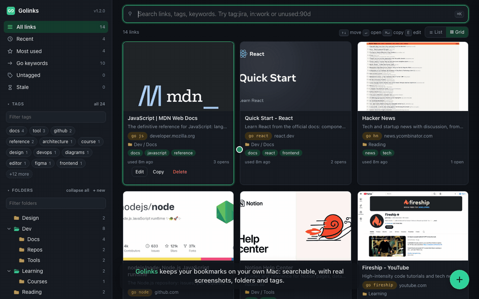

# Golinks

Smart bookmarks for macOS that stay on your machine. Type `:go expenses` in the
address bar, save the current tab with a screenshot from a bookmarklet or a
hotkey, and keep SSO pages (SharePoint, Confluence, Jira) with real thumbnails
because the screenshots are taken in your own browser.

No app is installed, nothing is compiled and nothing sits in your menu bar: a
small Node service runs as a login agent and the UI is a local web page. Your
data is plain JSON and JPEG files in this folder.

## Walkthrough



Two and a half minutes with captions: search and operators, go keywords, the
folder tree, dragging a card into a folder, the edit drawer with suggestions,
adding a link, and import and export. A sharper MP4 of the same walkthrough is
at [docs/demo.mp4](docs/demo.mp4). The recording uses a demo data set of
public sites, not real bookmarks.

## What you get

- **Address bar go-links.** `:go expenses` opens the link with that keyword.
  `:go jira PROJ-123` and `:go conf event portal` expand templates. Anything
  else searches and opens the best match, or shows the results.
- **Save any page with a real screenshot.** A bookmarklet, or a global hotkey
  through an Apple Shortcut, saves the tab you are on. Screenshots come from your
  own browser window, so pages behind SSO look right.
- **Search that understands your links.** Operators such as `tag:jira`,
  `site:atlassian`, `in:work`, `unused:90d`, `added:7d`, `is:stale`. Initials
  match, so `ep` finds "Event Portal design".
- **Folders and tags.** Nested folders (`Work/Projects/Alpha`), drag and drop,
  flat tags with automatic tagging rules from the URL.
- **Suggestions while you save.** Folder, tag and keyword chips from the URL,
  the page itself, and the links you already have. Nothing applies until you click.
- **Views.** All, Recent, Most used, Go keywords, Untagged, Stale, Unfiled, plus
  any folder or tag. List or grid, keyboard driven.
- **Import and export.** Read your browser's bookmarks directly or any file
  (bookmarks HTML, CSV, Excel, Markdown, Golinks JSON, text with URLs), with a
  preview and duplicate detection. Export to the same formats, all links or one
  folder or tag.
- **Setup checklist and doctor.** A page in the UI walks through the one-time
  steps and checks the macOS permissions for you. `bin/golinks doctor` does the
  same from Terminal.
- **Local only.** The service listens on 127.0.0.1, your data is plain files in
  the Golinks folder, and nothing leaves your machine.

## Install

Requirements: macOS, Node 18 or newer, and Chrome, Brave, Edge or Safari. No
Git, no Homebrew and no developer tools are needed.

### Step 1: install Node.js (once)

If you do not know whether you have it, you probably do not. Go to
[nodejs.org](https://nodejs.org), click **Download Node.js (LTS)**, open the
downloaded `.pkg` and click through the installer. It asks for your Mac
password. Developers who already use nvm, Volta or Homebrew can skip this; the
installer finds those too.

### Step 2: install Golinks

Open **Terminal** (press Cmd+Space, type `Terminal`, press Return), paste this
line and press Return:

```
curl -fsSL https://raw.githubusercontent.com/gvensan/golinks/master/install.sh | bash
```

That downloads Golinks to a `golinks` folder in your home folder, registers the
service to start at login, and opens the setup checklist in your browser at
http://localhost:7777/#/settings/setup. Set `GOLINKS_DIR=/some/path` before
the command to install somewhere else.

**Prefer to download by hand?** On the
[GitHub page](https://github.com/gvensan/golinks) click the green **Code**
button, then **Download ZIP**. Double-click the zip in Downloads to unpack it,
drag the `golinks-master` folder into your home folder (the one with the house
icon in Finder) and rename it `golinks`. Then, in Terminal:

```
cd ~/golinks
bash install.sh
```

Tip: type `cd ` in Terminal and drag the folder onto the Terminal window to fill
in the path. Keep the folder where the install ran; the service runs from it and
your links are stored in it. Do not unzip a newer version over it later, use
`bin/golinks update` instead (see [Staying up to date](#staying-up-to-date)).

**Developers**:

```
git clone git@github.com:gvensan/golinks.git ~/golinks
cd ~/golinks && ./install.sh
```

### Step 3: the setup checklist

The install opens **Settings > Setup checklist** in your browser. The same page
opens on its own the first time you visit the UI with no links. It lists the
one-time steps, with the exact values to copy, a **Mark done** button on each,
and a live permission check. Once the three required steps are done it drops
out of the sidebar and stays reachable under Settings.

1. **Service is running** (checked automatically). Version and port, started
   at login by launchd.
2. **Address bar go-links.** Add a site search in your browser with the name
   `Go Links`, shortcut `:go` and URL `http://localhost:7777/go/%s`. The page
   links to the right settings screen for Chrome, Brave and Edge and has a Copy
   button for the URL. Safari has no site search; use the UI or the search
   Shortcut there.
3. **Bookmarklet.** Drag the "Add to Golinks" button to your bookmarks bar.
4. **Allow screenshots of your browser.** macOS has to let the `node` process
   read browser tabs (Automation, asked automatically on first use) and capture
   the screen (Screen Recording, enabled by hand). The page shows the exact
   path to add under System Settings > Privacy & Security > Screen & System
   Audio Recording if `node` is not listed, then a **Re-check** button that runs
   the doctor and ticks the step when both permissions pass. Run
   `bin/golinks restart` after granting Screen Recording.
5. **Import your bookmarks** (optional). Opens Settings > Import.
6. **Hotkeys** (optional, not on the page). Two Apple Shortcuts give you
   Ctrl+Option+L to search and Ctrl+Option+A to save the current tab from any
   app. See `shortcuts/README.md`.

Everything works without steps 2 to 6; each one makes Golinks faster to use.

## Daily use

| Want to | Do |
| --- | --- |
| Open a link fast | Address bar: `:go expenses`, `:go jira PROJ-123`, `:go event portal` |
| Save the page you are on, with screenshot | Click the bookmarklet, or Ctrl+Option+A with the optional Shortcut |
| Search from anywhere | Ctrl+Option+L with the optional Shortcut, or `bin/golinks search` |
| Browse, edit, tag | http://localhost:7777 (or `bin/golinks open`); the round button bottom right adds a link |
| See what needs attention | Sidebar views: Recent, Most used, Go keywords, Untagged, Stale, Unfiled |
| Back up or move your links | Settings > Export (Golinks JSON, browser HTML, CSV, Excel, Markdown, URLs) |
| Save from a script | `curl -X POST localhost:7777/api/links -H 'content-type: application/json' -d '{"url":"https://..."}'` |

Web UI keys: arrows move, Enter opens, Cmd+Enter copies the URL, `E` edits,
`L` toggles list and grid, `N` adds, `/` focuses search, Esc closes. Every row
has Edit, Copy and Delete buttons. Hover the `i` next to a field for help.

Search operators: `tag:jira`, `site:atlassian`, `in:work` (folder path
contains), `unused:90d`, `added:7d`, `is:untagged`, `is:stale`, `is:keyword`.
Abbreviations match initials, so `ep` finds "Event Portal design".

## Tags and folders

**Tags** are flat labels; a link can have many. The sidebar shows the most used
ones as clickable badges, with a filter box to find the rest (Enter opens the
first match, `all N` shows every tag). Tagging rules (Settings) add tags to new
links automatically from the URL.

**Folders** hold a link in one place and can be nested: a folder is a path such
as `Work/Projects/Alpha`, with `/` between levels. Set it in the Folder field of
the edit drawer, the Add page or the bookmarklet popup, or drag a row or card
from the list onto a folder in the sidebar (or onto Unfiled) and confirm the
move; hovering a collapsed folder while dragging opens it. Typing a path that
does not exist yet creates the folders. The sidebar shows the tree with expand and
collapse, a filter box when there are many, and an `Unfiled` view for links
without a folder. Opening a folder lists its links and those of its subfolders,
with Open all and Copy all URLs, plus Subfolder, Rename (give the full new path
to move it, for example `Archive/Alpha`) and Delete folder (its links move up to
the parent). Folders can also be dragged in the sidebar onto another folder, or
onto the "Top level" zone that appears while dragging, and confirmed to move
them with their links and subfolders. Importing browser bookmarks keeps the bookmark folder structure.

Folders that were created but hold no links are remembered in
`data/folders.json`; everything else is derived from the `folder` field on each
link. Files from version 1.1 with a `collection` field are migrated to `folder`
on first start.

**Go keyword**: give a link a short unique name in the edit drawer, then
`:go name` opens it directly. **Templates** (Settings) add parameterized ones:
`:go jira PROJ-123`, `:go conf event portal`. Anything else runs a search and
opens the best match when it is confident, otherwise the UI with results.

## Suggestions when saving

The Add page, the bookmarklet popup and the edit drawer show clickable
suggestion chips for the folder, tags and go keyword. Nothing is applied until
you click. Three sources feed them:

- **The URL.** Jira issues and boards, Confluence spaces, SharePoint sites and
  libraries, OneDrive, GitHub and GitLab repositories and Google Docs are
  recognised: `PROJ-123` becomes a keyword and `Jira/PROJ` a folder, a Confluence
  space key becomes a tag and `Confluence/KEY` a folder, and so on.
- **The page.** The bookmarklet runs inside the page, so it also works on SSO
  pages. It reads meta keywords, article tags, GitHub topics and Jira labels for
  tag suggestions, breadcrumbs (Confluence, SharePoint, JSON-LD) for a folder
  suggestion, and author, published date and canonical URL. Author and date can
  be added to the notes with one click.
- **Your own links.** Folders and tags used by links on the same host are
  suggested, ranked higher the more of the path they share. Keyword candidates
  come from the title initials and the last part of the URL, skipping names that
  are already taken.

## Import and export

Settings has tabs for general settings, the setup checklist, Import and Export.

**Export** writes every link, or just one folder (with its subfolders) or one
tag, in the format you pick, or shows just the URLs on the page (optionally
with titles) to copy to the clipboard: Golinks JSON (every field plus the folder list,
the format for backups and moving between machines), browser bookmarks HTML
(what Chrome, Brave, Edge, Safari and Firefox import; folders nest and tags
are kept), CSV, an Excel workbook, a Markdown list grouped by folder, or plain
URLs one per line.

**Import** reads a browser profile directly, or any file in the formats above:
Chrome-style Bookmarks JSON, Golinks JSON, bookmarks HTML, CSV or Excel with a
header row (columns such as url, title, folder, tags, keyword, notes are matched
loosely), Markdown, or any text with URLs in it. Everything is previewed with
duplicate detection first. Folders, tags, keywords (when free), notes and dates
survive the trip; tagging rules still add their tags.

Screenshots on import, chosen in the preview: **through my browser** (default)
opens each imported page in a new tab of your front browser window for a few
seconds, screenshots it through your own session so pages behind SSO come out
right, and closes the tab; **in the background** uses headless Chrome and only
works for public pages, others get a tile; **tiles only**; or **none**. The
sidebar shows progress and Settings > Snapshots has a Stop button. Pages that
land on a sign-in screen are skipped and keep their tile. Settings > Snapshots
can run either kind of capture later for links that are missing a snapshot or
have a tile.

## Snapshots

Preference order: a screenshot of your own browser window (the bookmarklet
popup, the Add page and the drawer's "From browser tab" button ask the service
to capture the browser tab showing the URL, in any window on the current Space,
switching to that tab for a moment if needed), then the page's og:image,
then headless Chrome for public pages, then a generated tile. Screenshots are
cropped below the toolbar and resized to 960 px JPEG with the system `sips`.

## Settings

The general tab of Settings (http://localhost:7777/#/settings) holds:

- **General.** Port, the number of days after which an unopened link counts as
  stale, the confidence score a `:go` search needs before it opens a result
  directly, the browser toolbar height cropped from screenshots, whether
  headless snapshots run at all, and whether revisiting a saved page refreshes
  its snapshot.
- **Templates.** The parameterized go-links as editable JSON. `{0}` and `{1}`
  are the words after the name, `{q}` is everything after the name URL-encoded,
  `{*}` is the raw text.
- **Tagging rules.** Regex against the URL, tags to add, `$1` for the first
  capture group. Applied to every new link, including imports.
- **Snapshots.** Counts of links without a snapshot or with a tile, and buttons
  to capture them through your browser or headless Chrome, with Stop.
- **Delete all links.** Wipes every link and snapshot, and optionally the
  empty folders, after you type DELETE. Tagging rules, templates and settings
  stay.

The UI shows a "restart needed" banner when the code on disk is newer than the
running service, for example after an update.

## Staying up to date

```
bin/golinks update
```

Run it from the Golinks folder, or from anywhere as `~/.golinks/bin/golinks
update`. In a git clone it pulls; in a folder that came from the zip or the
one-line installer it downloads the latest code and copies it over the old
files. Either way your `data/` and `snapshots/` folders are left alone, the
Node link is refreshed and the service restarts. Running the one-line install
command again on an existing install does the same thing.

Do not unpack a new zip over your Golinks folder by hand: that would replace
`data/` and `snapshots/`, which is where your links live.

## Commands

All commands live in `bin/golinks`. Run them from the Golinks folder, or from
anywhere through the `~/.golinks` link that the install creates.

```
bin/golinks status | doctor | logs        health, permission checks, log tail
bin/golinks stop | start | restart        control the service
bin/golinks update                        latest code (git pull or download), refresh node link, restart
bin/golinks open                          open the web UI
bin/golinks install                       (re)install the login agent
./uninstall.sh [--purge]                  remove agents and links; --purge also deletes your data
```

The service starts at every login. A crash restarts it within seconds; a
deliberate stop (UI, Shortcut, `golinks stop`) stays stopped until login or
`start`.

**Doctor** checks the Node version, the login agent, the port, and the
Automation and Screen Recording permissions of the running service, and prints
a fix for anything that fails. The same checks run inside the setup checklist.

**Uninstall** with `./uninstall.sh` stops and removes the login agent and the
`~/.golinks` link and leaves your data in the folder. `./uninstall.sh --purge`
deletes your links and snapshots too, after asking. Things it cannot remove for
you are listed at the end: the browser site search, the bookmarklet, the
Shortcuts and the permissions granted to `node`.

## Where things live

```
server.js, lib/        service: store, search, rules, enrich, snapshots, capture, importer
public/                web UI (no build step)
shortcuts/             Shortcut helper scripts and setup notes
bookmarklet/           bookmarklet source and notes
launchd/               plist templates rendered by golinks install
data/defaults/         shipped tagging rules and go-link templates (copied on first run)
data/                  YOUR links.json, folders.json, settings.json, rules.json, templates.json (git ignored)
snapshots/             YOUR thumbnails (git ignored)
~/.golinks             symlink to this folder, used by the Shortcuts and for running commands from anywhere
~/Library/LaunchAgents/dev.golinks.plist    the login agent
```

Personal data is git-ignored so the code repo can be shared. To sync your own
links between machines, make `data/` and `snapshots/` a private repo of their
own, or set `LINKS_HOME=/path` before `golinks install` to keep them elsewhere
(for example in a synced folder). Settings > Export in Golinks JSON format is
the simplest backup.

## HTTP API

```
GET  /go/:text                 omnibox redirect       GET  /open/:id           record use, redirect
GET  /api/health  /api/meta  /api/doctor
GET  /api/search?q=&tag=&folder=&view=&limit=          folder= includes subfolders
GET|POST /api/links            GET|PUT|DELETE /api/links/:id     POST /api/links/:id/use
POST /api/links/:id/snapshot   {snapshot: base64} | {imageUrl} | {mode:"browser"} | {mode:"tile"} | {}
DELETE /api/links/:id/snapshot
POST /api/capture {url}        screenshot of the browser window showing url (data URL)
POST /api/enrich {url, fetch?, title?, page?}   page: metadata from the bookmarklet; returns suggest {folders, tags, keywords}
GET  /api/links/:id/suggest    suggestions for an existing link
GET  /api/import/sources       POST /api/import/chrome  POST /api/import/file {name, content, encoding}  POST /api/import/text  POST /api/import/commit
GET  /api/export?format=json|html|csv|xlsx|md|txt&folder=&tag=      add &preview to get {count, filename} instead of the file
GET|POST /api/folders {path}   POST /api/folders/rename {from, to}   POST /api/folders/delete {path, links: parent|root|delete}
POST /api/snapshots/refresh {only: missing|tiles|all}     queue background (headless) captures
GET|POST /api/snapshots/browser {ids?|only}   POST /api/snapshots/browser/stop     capture through the user's browser
POST /api/links/delete-all {confirm:"DELETE", folders?}   wipe every link and snapshot
GET|PUT /api/settings /api/rules /api/templates      POST /api/tags/rename     GET /api/bookmarklet
POST /quit
```

`POST /api/links` accepts `url, title, description, tags, aliases, keyword,
notes, folder ("Work/Projects"), snapshot (base64), snapshotUrl, snapshotMode
(auto|tile|none), source, enrich (false skips the page fetch), force`. The old
`collection` name is still accepted for `folder`. Duplicates return 409 with
the existing link. The service binds 127.0.0.1 only and rejects cross-origin
writes.

## Development

`npm test` runs the unit tests. `bin/golinks run` starts the server in the
foreground. `PLAN.md` has the original design and constraints.
    

## License

MIT, see [LICENSE](LICENSE). Golinks has no third-party dependencies, so that
one file covers everything in the repo.
